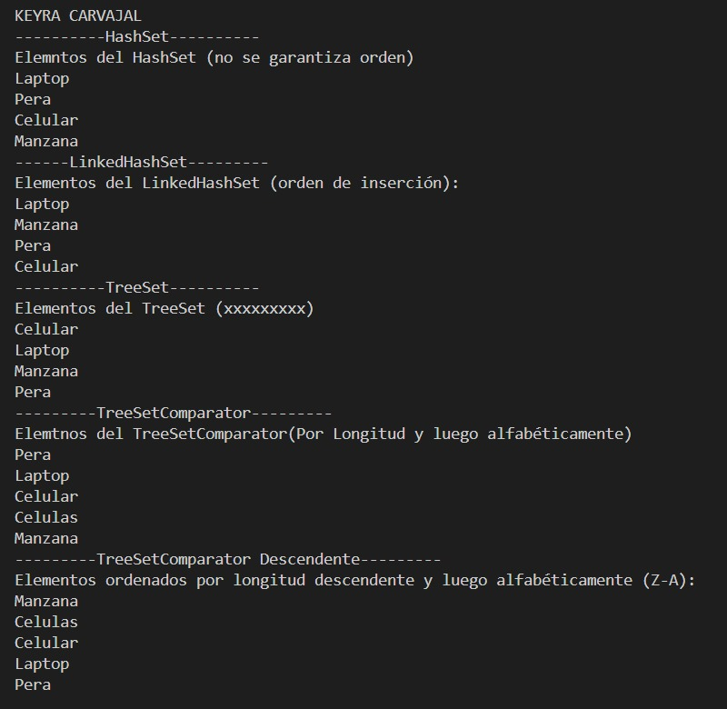

# Práctica de Algoritmos SETS

## 📌 Información General

- **Título:** SETS
- **Asignatura:** Estructura de Datos
- **Carrera:** Computación
- **Estudiante:** Keyra Carvajal
- **Fecha:** 01/07/2025
- **Profesor:** Ing. Pablo Torres

---
## 📚 Descripción:

Este proyecto muestra el uso de la interfaz `Set` en Java, incluyendo las implementaciones más comunes:

- `HashSet`
- `LinkedHashSet`
- `TreeSet` con y sin comparador personalizado

El objetivo es entender cómo funcionan los conjuntos en Java, cómo eliminan duplicados automáticamente y cómo pueden ordenarse con comparadores.

---

## ⚙️ Métodos implementados

### 🔹 `construirHashSet()`
Crea un `HashSet` con varias palabras (algunas repetidas) y demuestra que elimina los duplicados sin mantener orden específico.

### 🔹 `construirLinkedList()`
Crea un `LinkedHashSet` que **mantiene el orden de inserción** y elimina duplicados.

### 🔹 `construirTreeSet()`
Crea un `TreeSet` que **ordena alfabéticamente** y elimina duplicados.

### 🔹 `construirTreeSetConComparador()`
Crea un `TreeSet` usando un `Comparator` que ordena las palabras:
- Por **longitud creciente**
- Y si son iguales, por **orden alfabético (A-Z)**

### 🔹 `construirTreeSetConComparadorDescendente()`
Crea un `TreeSet` con un comparador que ordena:
- Por **longitud decreciente**
- Y si son iguales, por **orden alfabético inverso (Z-A)**

---

## 📤 Ejecución

Cada método tiene un `run...()` asociado para mostrar en consola los elementos del `Set` y la cantidad total de elementos únicos.

Ejemplo:

```java
public static void main(String[] args) {
    Sets sets = new Sets();
    runHashLinkeadas(sets);
    runTreeSet(sets);
    runTreeSetConComparadorDescendente(sets);
}

---

## Imagen de la ejecución



